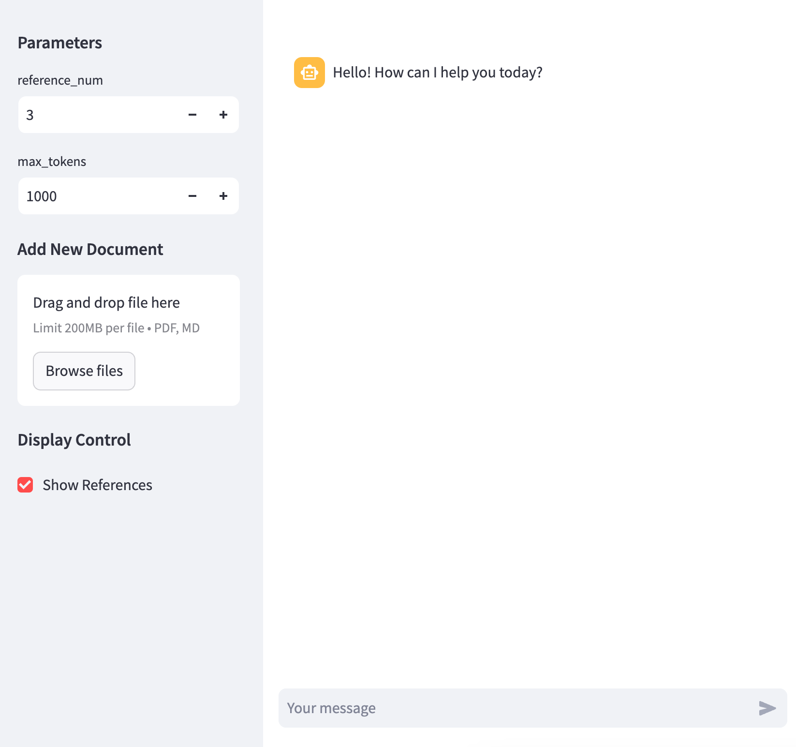

# LLm RAG DEMO


## Introduction

This project demonstrates the use of a Large Language Model (LLM) for Retrieval-Augmented Generation (RAG). The RAG approach combines the strengths of information retrieval and generative models to provide more accurate and contextually relevant responses. In this demo, we use the RAG model to generate responses to user queries by retrieving relevant information from a knowledge base.


## Usage

```bash
pip install -r requirements.txt
```

```bash
streamlit run webui.py
```

## Resources
- [PyMUPDF](https://pymupdf.readthedocs.io/en/latest/)
- [MarkdownHeaderTextSplitter](https://python.langchain.com/v0.1/docs/modules/data_connection/document_transformers/markdown_header_metadata/)
- [Chroma](https://docs.trychroma.com/)
- [Advanced RAG Techniques: Unlocking the Next Level](https://medium.com/@krtarunsingh/advanced-rag-techniques-unlocking-the-next-level-040c205b95bc)

## RAG UI Example

